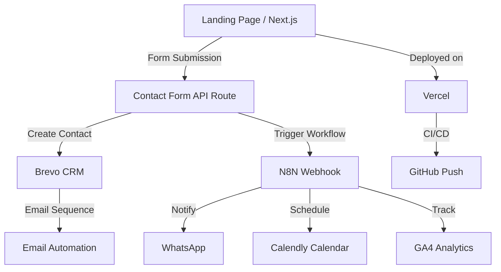
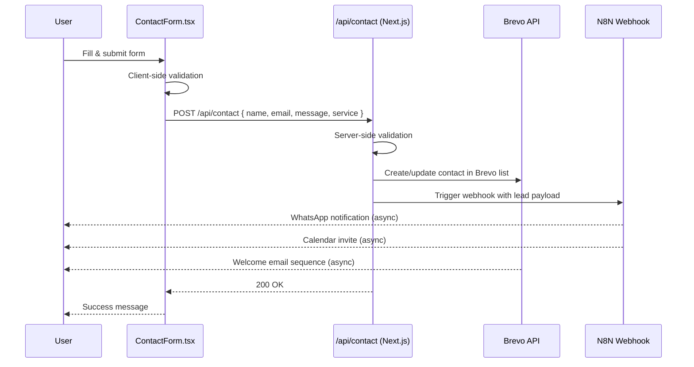
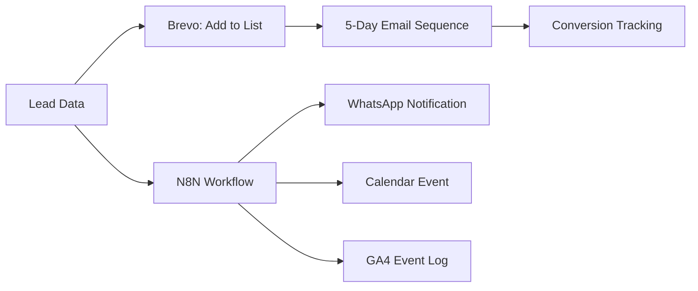

# GrankAgency — Architecture

## System Overview



## Tech Stack

| Layer | Technology |
|---|---|
| Frontend | Next.js 14 + React |
| Language | TypeScript |
| Styling | Tailwind CSS |
| Deployment | Vercel |
| CRM / Email | Brevo API |
| Automation | N8N |
| Calendar | Calendly API |
| Analytics | GA4 + GTM |
| Database | PostgreSQL (via DATABASE_URL) |

---

## Frontend Structure

```
app/
├── page.tsx              ← Landing page (hero, services, testimonials)
├── layout.tsx            ← Global layout (header, footer, metadata)
├── contact/
│   └── page.tsx          ← Contact page with lead capture form
├── portfolio/
│   └── page.tsx          ← Case studies / client work
└── services/
    └── page.tsx          ← Service detail pages

components/
├── Header.tsx            ← Navigation bar
├── Footer.tsx            ← Footer links & social
├── ContactForm.tsx       ← Lead capture form (validation + submission)
├── ServiceCard.tsx       ← Service display card
└── AnimatedSection.tsx   ← Scroll-triggered animation wrapper
```

---

## Data Flow: Lead Capture



---

## Data Flow: Automation Pipeline



---

## Component Hierarchy

```
layout.tsx
└── Header.tsx
└── page.tsx (or route pages)
    ├── AnimatedSection.tsx
    │   └── ServiceCard.tsx (mapped list)
    ├── ContactForm.tsx
    │   ├── Input fields
    │   └── Submit → /api/contact
    └── Footer.tsx
```

---

## API Integration Points

### Brevo (CRM / Email Automation)
- **Endpoint:** Brevo REST API v3
- **Trigger:** On successful form submission
- **Actions:**
  - `POST /contacts` — create or update contact
  - Assign to list by service type (`BREVO_LIST_ID`)
  - Trigger automation journey (email sequence)
- **Env vars:** `BREVO_API_KEY`, `BREVO_LIST_ID`, `BREVO_SENDER_EMAIL`, `BREVO_SENDER_NAME`

### N8N (Workflow Automation)
- **Endpoint:** `N8N_WEBHOOK_URL` (POST)
- **Trigger:** Immediately after Brevo contact creation
- **Workflow steps:** validate → WhatsApp alert → calendar event → GA4 log
- **Env vars:** `N8N_WEBHOOK_URL`, `N8N_API_KEY`

### Calendly (Calendar Scheduling)
- **Trigger:** User clicks "Book a Call" button
- **Integration:** Calendly embed widget or redirect
- **Env vars:** `CALENDLY_API_KEY`

### GA4 + GTM (Analytics)
- **Client-side:** `NEXT_PUBLIC_GA_ID` loaded in `layout.tsx`
- **Server-side events:** Sent via N8N after lead submission
- **Events tracked:** `form_view`, `form_submit`, `calendar_click`, `service_view`
- **Env vars:** `NEXT_PUBLIC_GA_ID`, `NEXT_PUBLIC_GTM_ID`

---

## Security Considerations

- All API keys are stored in environment variables — never in source code
- `NEXT_PUBLIC_*` prefix only used for non-sensitive, browser-safe values
- `.env` and `.env.local` are in `.gitignore`
- Form inputs are validated both client-side (TypeScript) and server-side (API route)
- CORS is handled automatically by Vercel's edge network
- Rate limiting on `/api/contact` is recommended for production

---

## Deployment Pipeline

```
Developer pushes to GitHub (main branch)
    ↓
Vercel detects push via GitHub integration
    ↓
Vercel runs: npm install → npm run build
    ↓
Build artifacts deployed to Vercel CDN
    ↓
Environment variables injected from Vercel dashboard
    ↓
Live URL updated (preview or production)
```

**Required Vercel environment variables:**
- `BREVO_API_KEY`, `BREVO_LIST_ID`, `BREVO_SENDER_EMAIL`, `BREVO_SENDER_NAME`
- `N8N_WEBHOOK_URL`, `N8N_API_KEY`
- `NEXT_PUBLIC_GA_ID`, `NEXT_PUBLIC_GTM_ID`
- `CALENDLY_API_KEY`
- `DATABASE_URL` (if DB is used)

---

## Performance Considerations

- Next.js App Router uses React Server Components — minimal JS sent to client
- Tailwind CSS purges unused styles at build time → small CSS bundle
- Images should use `next/image` for automatic WebP conversion and lazy loading
- API routes are serverless functions on Vercel — auto-scale on demand
- Animated sections use `IntersectionObserver` for scroll-triggered renders (no scroll listeners)

---

## Monitoring & Debugging

| Tool | Purpose |
|---|---|
| Vercel Dashboard | Deployment logs, function logs, build errors |
| GA4 Real-Time | Live traffic and event tracking |
| N8N Execution Log | Workflow run history and errors |
| Brevo Reports | Email delivery rates, open rates, bounces |
| Browser DevTools | Network tab for API call inspection |

---

## Future Roadmap

- [ ] PostgreSQL integration for persisting leads locally
- [ ] Admin dashboard to view submitted leads
- [ ] A/B testing for landing page sections
- [ ] Multi-language support (i18n)
- [ ] Automated testing (Playwright E2E, Jest unit)
- [ ] Docker Compose for local development
- [ ] Zapier fallback if N8N is unavailable
